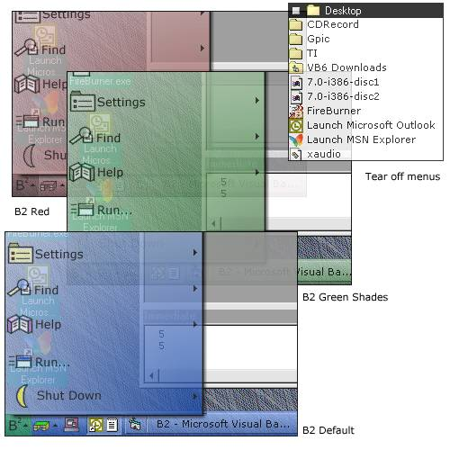



## B2 \(BoS 2\.0\) \- Translucent, skinnable, t hree\-time award winning shell

### Description

It's here! B2 is BoS 2.0.  A shell is a program that replaces your taskbar, desktop icons, and start menu with better looking, more functional versions. B2 is no exception. Features include: Skinnable taskbar and menus (3 skins included), animated, scrolling, translucent menus with alpha shadows (even on Windows 98), QuickLaunch tray for frequent functions, shutdown, find, programs, favorites, documents, help, and settings menus, desktop menu, tear off menus (drag the menu titlebar to make it into a window), resizable, movable, docking taskbar, and lots more!  NOTES: Be sure to copy Alphablending.dll and ccrpTmr6.dll to your \windows\system folder. B2 is released under the GPL. Please read Copying.txt if you wish to distribute B2 or use code from it. Also, B2 ONLY RUNS on Windows 98, ME, or 2000.    People must love my code! Three awards for the same code, it's rediculous! However, thanks anyway to everyone who voted. (My not-so-secret plan is to win the award again in December :-)
 
### More Info
 

             |
---                |---
**Submitted On**   |2000-10-01 15:36:46
**By**             |[Brian](https://github.com/Planet-Source-Code/PSCIndex/blob/master/ByAuthor/brian.md)
**Level**          |Advanced
**User Rating**    |4.7 (280 globes from 59 users)
**Compatibility**  |VB 6\.0
**Category**       |[Complete Applications](https://github.com/Planet-Source-Code/PSCIndex/blob/master/ByCategory/complete-applications__1-27.md)
**World**          |[Visual Basic](https://github.com/Planet-Source-Code/PSCIndex/blob/master/ByWorld/visual-basic.md)
**Archive File**   |[CODE\_UPLOAD103401012000\.zip](https://github.com/Planet-Source-Code/brian-b2-bos-2-0-translucent-skinnable-t-hree-time-award-winning-shell__1-11819/archive/master.zip)

